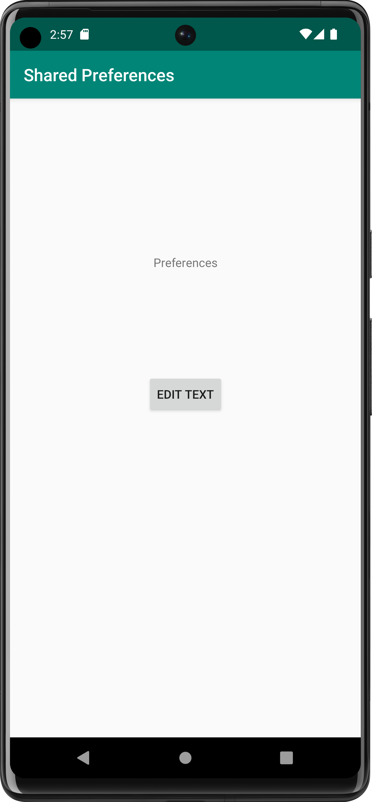
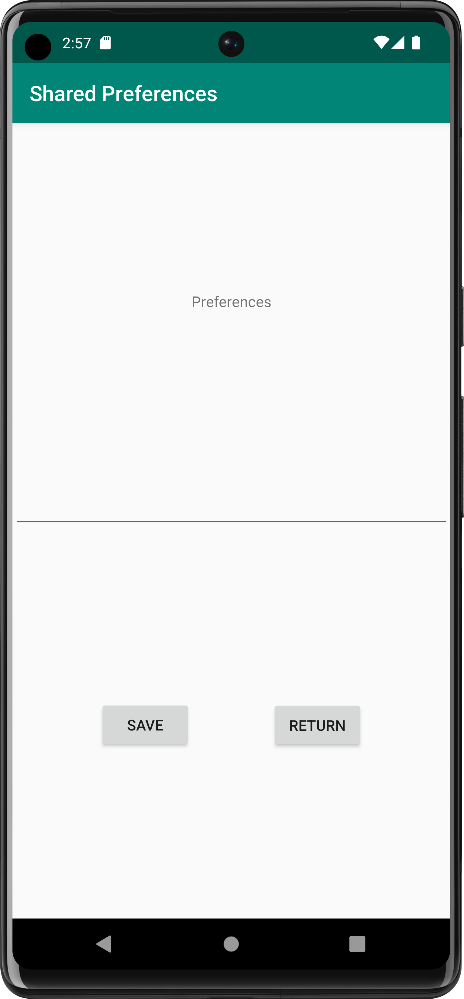

# Rapport

**Skriv din rapport här!**

_Du kan ta bort all text som finns sedan tidigare_.

## Följande grundsyn gäller dugga-svar:

- Ett kortfattat svar är att föredra. Svar som är längre än en sida text (skärmdumpar och programkod exkluderat) är onödigt långt.
- Svaret skall ha minst en snutt programkod.
- Svaret skall inkludera en kort övergripande förklarande text som redogör för vad respektive snutt programkod gör eller som svarar på annan teorifråga.
- Svaret skall ha minst en skärmdump. Skärmdumpar skall illustrera exekvering av relevant programkod. Eventuell text i skärmdumpar måste vara läsbar.
- I de fall detta efterfrågas, dela upp delar av ditt svar i för- och nackdelar. Dina för- respektive nackdelar skall vara i form av punktlistor med kortare stycken (3-4 meningar).

Programkod ska se ut som exemplet nedan. Koden måste vara korrekt indenterad då den blir lättare att läsa vilket gör det lättare att hitta syntaktiska fel.

För att fixa denna uppgift har först en ny aktivitet lagts till och döpts till MyActivity.
Denna har sedan fått en EditText, Button och TextView widget.
En knapp och funktionalitet har även lagts till i MainActivity som startar MyActivity

SharedPreference variabler har lagts till i MyActivity med:
//

    private SharedPreferences myPreferenceRef;
    private SharedPreferences.Editor myPreferenceEditor;

//
myPreferenceRef lagrar data som sparas mellan användingar av appen och
myPreferenceEditor ändrar datan som lagras.

Sedan har funktionen att ändra datan som lagras genom att skriva in en
sträng i ett textfält i activity_my.
//

    public void savePref(View view) {
    EditText newPrefText = findViewById(R.id.settingseditview);

        //Sätter MyPreferenceEditor till strängen som läggts in i EditText widgeten "settingseditview"
        myPreferenceEditor.putString("MyAppPreferenceString", newPrefText.getText().toString());
        myPreferenceEditor.apply();

//
Sist har en onResume() lagts till i MainActivity som gör att TextView widgeten i MainActivity
ändras till det som sparas från MyActivity.
En knapp har även lagts till i MyActiivty som gör att man kan
ta sig tillbaka till MainActivity.

Knapparna för att spara preferences och byta mellan aktiviteter är separerade för att
göra med möjligt att se vad för data man har lagt in i TextView widgeten i activity_my


```
function errorCallback(error) {
    switch(error.code) {
        case error.PERMISSION_DENIED:
            // Geolocation API stöds inte, gör något
            break;
        case error.POSITION_UNAVAILABLE:
            // Misslyckat positionsanrop, gör något
            break;
        case error.UNKNOWN_ERROR:
            // Okänt fel, gör något
            break;
    }
}
```

Bilder läggs i samma mapp som markdown-filen.





Läs gärna:

- Boulos, M.N.K., Warren, J., Gong, J. & Yue, P. (2010) Web GIS in practice VIII: HTML5 and the canvas element for interactive online mapping. International journal of health geographics 9, 14. Shin, Y. &
- Wunsche, B.C. (2013) A smartphone-based golf simulation exercise game for supporting arthritis patients. 2013 28th International Conference of Image and Vision Computing New Zealand (IVCNZ), IEEE, pp. 459–464.
- Wohlin, C., Runeson, P., Höst, M., Ohlsson, M.C., Regnell, B., Wesslén, A. (2012) Experimentation in Software Engineering, Berlin, Heidelberg: Springer Berlin Heidelberg.
